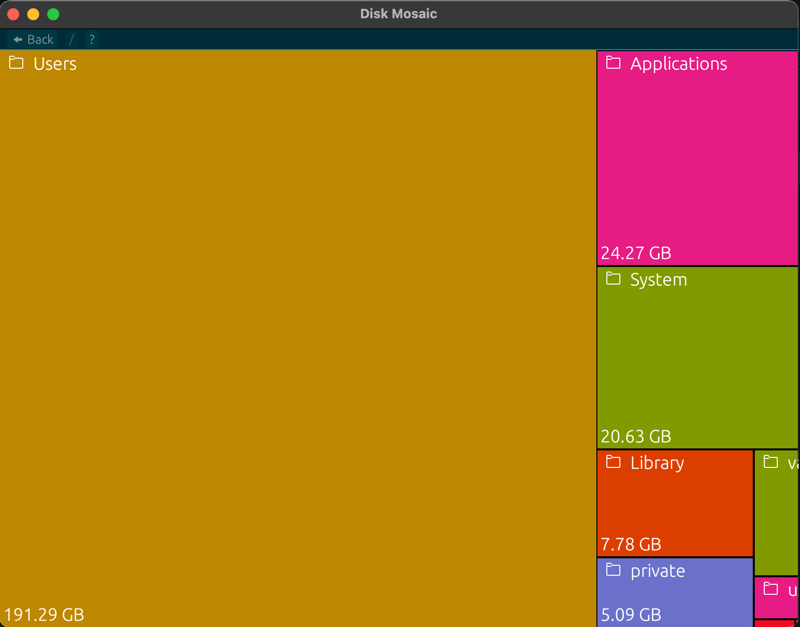

# Disk-Mosaic

## Description

Disk Mosaic is a utility tool that helps you visually identify how your disk space is used and where.

## Installation

### Via releases

Some compiled binaries are available in Github releases

## Dependencies

- thiserror
- env_logger
- egui
- egui_extras
- eframe
- home
- humansize
- treemap
- log
- rayon
- open
- egui_solarized
- sysinfo
- rfd
- unicode
- opener
- serde
- serde_json
